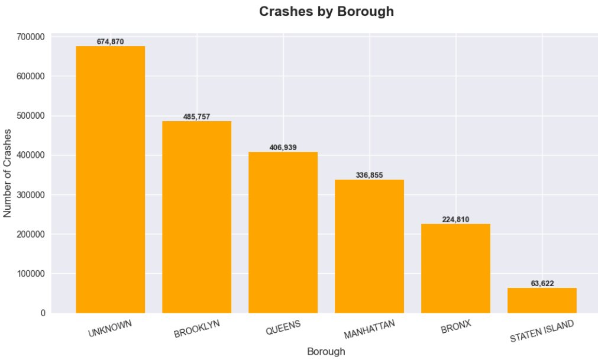

# 🚗 NYC Vehicle Collisions Analysis

An in-depth analysis of NYC vehicle collisions, showcasing trends, key contributing factors, and crash severity across boroughs.  
Includes interactive visualizations and data-driven insights to improve road safety awareness.

---

## **Preview of Analysis**

### **Key Visuals**
  
  
  
  
  


---

## **Interactive Heatmap**
Explore high-density crash locations with an interactive heatmap:  
**[Open the Heatmap](./nyc_crashes_heatmap_with_boroughs.html)**  
*(Open this file in a browser for an interactive experience.)*

---

## **Dataset**
Due to GitHub's file size limit (100 MB), the dataset is not included here.  
**Download the original CSV:**  
[NYC Motor Vehicle Collisions Open Data](https://data.cityofnewyork.us/Transportation/Motor-Vehicle-Collisions-Crashes/h9gi-nx95)

---

## **How to Run**

1. Clone this repository:
   ```bash
   git clone https://github.com/Sophos333/nyc-vehicle-collisions.git

2. Install the following Python libraries:
    pip install pandas, matplotlib, folium

3. Open the notebook:
    jupyter notebook nyc_collision_analysis.ipynb

---

## **Tech Stack**

- **Python** (Pandas, Matplotlib, Folium)
- **Jupyter Notebook**
- **Data Visualization**

---

## **Connect with Me**

If you find this project interesting, **star this repo** and connect with me on [LinkedIn](https://www.linkedin.com/in/yashuasspear-oscar-holguin-silva/).

---
